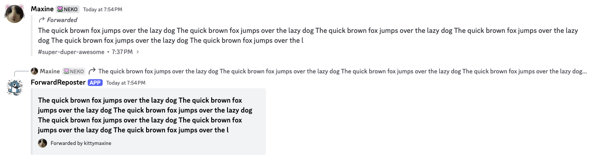

# forwardrepostbot
Basic Discord bot to repost forwarded messages as basic embeds for older clients\\

# Setup
## Manual:
Place your token in the text file named token.txt\
Install the latest development (2.5.0) of Discord.py and use `python3 bot.py` to start the bot. 

## Docker:
Clone this repository: `git clone https://github.com/ceilingtilefan/forwardrepostbot` enter the repository folder
Set the TOKEN environment variable: `export TOKEN=PLACE TOKEN HERE`
Start the container: `docker compose up` (you can add `-d` to make it start automatically)

# Features
Automatically reposts forwarded messages as embeds. Does not work with attachments (yet)
